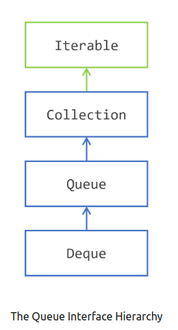

# Overview
> Java SE 5 saw the addition of a new interface in the Collections Framework: the `Queue` interface, further extended in Java SE 6 by the `Deque` interface. The `Queue` interface is an extension of the `Collection` interface.



## 1.Stack (LIFO – Last In, First Out)
#### **Hierarchy of Stack in Java:**
```java
java.util.Collection
        ↑
java.util.List
        ↑
java.util.Vector
        ↑
java.util.Stack
```
- **A Stack follows the LIFO principle.**
- Operations:
  - `push(element)`: Adds an element to the top.
  - `pop()`: Removes the top element
  - `peek()`: Views the top element without removing it.
- **Example of Stack Operations:**
```java
Stack<Integer> stack = new Stack<>();

// Push elements
stack.push(10);
stack.push(20);
stack.push(30);

System.out.println("Top element (peek): " + stack.peek()); // 30
System.out.println("Popped element: " + stack.pop()); // 30
System.out.println("Stack after pop: " + stack);//[10, 20]
```
#### FAQ: 
 ##### A. Why new Stack<>() for Stack? 
1. `Stack` is a concrete class, so we can directly instantiate it.
2. It extends `Vector`, which provides thread safety but is not the most efficient choice
3. **Modern Alternative:** `Deque<Integer> stack = new ArrayDeque<>();`
4. `ArrayDeque` is recommended because it is faster and more efficient than `Stack`.

## 2.Queue (FIFO – First In, First Out)
#### **Hierarchy of Queue in Java:**
```java
        java.util.Collection
                ↑
         java.util.Queue
                ↑
    java.util.LinkedList (implements Queue)
```
- **A `Queue` follows the FIFO principle.**
- Operations:
  - `offer(element)`: Adds an element to the queue.
  - `poll()`: Removes the oldest element.
  - `peek()`: Views the front element without removing it.
- **Example of `Queue` Operations:**
```java
Queue<Integer> queue = new LinkedList<>();
queue.add(1); 
queue.offer(2);
queue.offer(3);
System.out.println("queue" + queue); //[1, 2, 3]
System.out.println(queue.peek()); // 1
System.out.println(queue.poll()); // 1
System.out.println(queue.remove()); // 2
System.out.println("queue" + queue); //[3]
```

#### FAQ:
##### A. Why new LinkedList<>() for Queue?
1. `Queue` is an interface, so we need a concrete class to instantiate it.
2. `LinkedList` is a commonly used implementation of `Queue`, offering efficient FIFO behavior.
3. `LinkedList` implements both Queue and Deque, making it more flexible.
##### B. What is the Alternative Implementations for Queue?
1. `PriorityQueue<>` (Maintains natural order).
2. `ArrayDeque<>` (Efficient and recommended over LinkedList for queues).
##### C. What is difference between `offer()` and `add()` also some others operations ?
> Both offer(E e) and add(E e) methods are used to insert elements into a Queue in Java. However, they behave differently when the queue is full or has capacity restrictions.

| Operation | Method         | Behavior when the queue is full or empty |
|-----------|---------------|------------------------------------------|
| push      | `add(element)`   | Throws `IllegalStateException` |
|           | `offer(element)` | Returns `false` |
| poll      | `remove()`       | Throws `NoSuchElementException` |
|           | `poll()`         | Returns `false` |
| peek      | `element()`      | Throws `NoSuchElementException` |
|           | `peek()`         | Returns `null` |


## 3. Deque (Double-Ended Queue) Explained

A **Deque** (short for **Double-Ended Queue**) is a linear data structure that allows **insertion and deletion from both ends (front and rear).**  
It can act as both a **Queue (FIFO - First In, First Out)** and a **Stack (LIFO - Last In, First Out).**

### A. Key Features of Deque:
- Allows insertion and removal from both **front** and **rear**.
- Supports both **FIFO (Queue-like behavior)** and **LIFO (Stack-like behavior)**.
- Implemented in Java using `Deque` interface and `ArrayDeque` or `LinkedList` classes.

### B. Connection Between Queue, Stack, and Deque

| **Structure**       | **Insertion/Removal**                        | **Method Used**                                      | **Example Use Case**               |
|---------------------|--------------------------------------------|------------------------------------------------------|------------------------------------|
| **Queue (FIFO)**    | Insertion at rear, removal from front     | `offer()`, `poll()`                                  | Task scheduling, message queues   |
| **Stack (LIFO)**    | Insertion and removal from the same end (top) | `push()`, `pop()`                                    | Undo/Redo, recursion              |
| **Deque (Both FIFO & LIFO)** | Insertion and removal from both ends | `addFirst()`, `addLast()`, `removeFirst()`, `removeLast()` | Browsing history, palindromes    |
